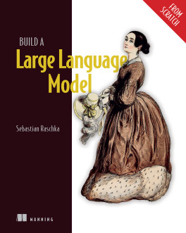

# Building-Large-Language-Models-from-Scratch

This will be my walk through of the book "Building Large Language Models from Scratch" by Sebastian Raschka

  

 As of Monday, September 23, 2024, this book has not yet been released but will be October 29, 2024 on amazon.ca.

 I am expecting the [current repo](https://github.com/rasbt/LLMs-from-scratch) to be updated up until that publication date.

## Monday, September 23, 2024

Setting up of the local mamba environment for this book. 

 1) mamba create -n llmfs
 2) mamba activate llmfs
 3) mamba install conda-forge::python
 4) mamba install conda-forge::jupyterlab
 5) mamba install pytorch torchvision torchaudio pytorch-cuda=11.8 -c pytorch -c nvidia
 6) mamba install conda-forge::tiktoken
 7) mamba install conda-forge::matplotlib
 8) mamba install conda-forge::pandas
 9) mamba install conda-forge::tqdm
10) mamba install conda-forge::psutil